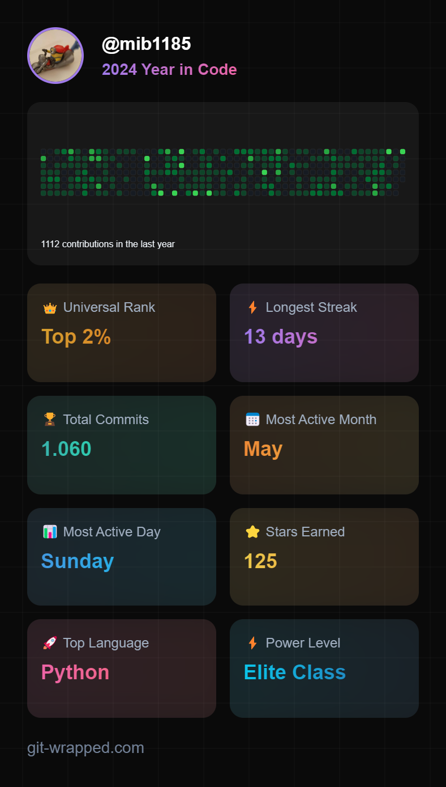

<table border="0" cellspacing="0" cellpadding="0">
<tr>
<td>
  
## Hi there 👋 I'm Michael

### I'm not a native developer

... but a lazy IT-guy and in my free time a smart-home enthusiast 🏠 so before I do a task several times, I automate it 🤓

I'm used to use [ansible](https://github.com/ansible), [python](https://github.com/python) and other script languages for automation tasks by day.

By night you'll find me doing stuff for the [Home Assistant](https://github.com/home-assistant) project and also some custom projects around home automation and home assistant (_see my pinned repositories below_)

---
You like my work?

</td>
<td width="350">

</td>
</tr>
</table>

<!--
**mib1185/mib1185** is a ✨ _special_ ✨ repository because its `README.md` (this file) appears on your GitHub profile.

Here are some ideas to get you started:

- 🔭 I’m currently working on ...
- 🌱 I’m currently learning ...
- 👯 I’m looking to collaborate on ...
- 🤔 I’m looking for help with ...
- 💬 Ask me about ...
- 📫 How to reach me: ...
- 😄 Pronouns: ...
- ⚡ Fun fact: ...
-->
